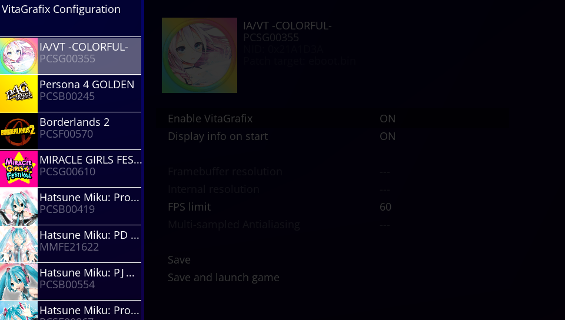
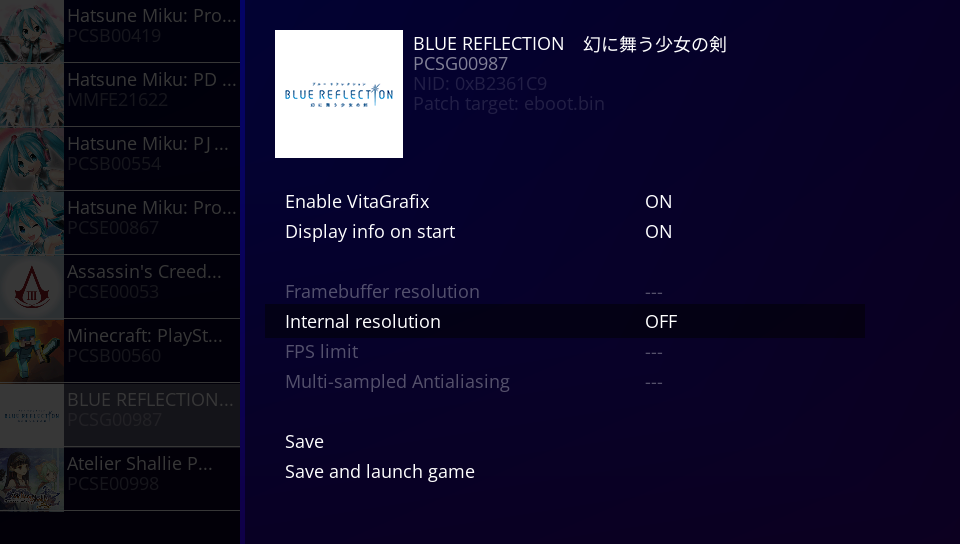
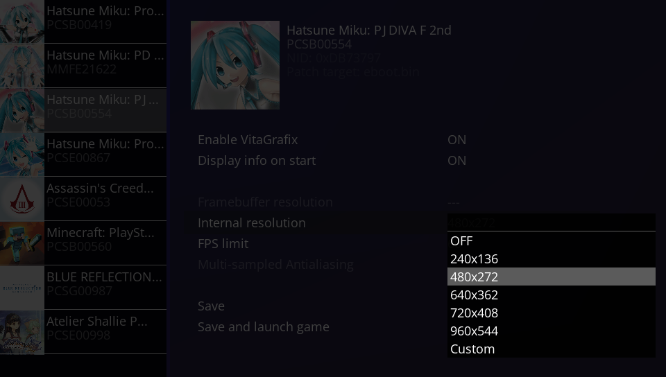

# BetterVitaGrafixConfigTool

Basically just VitaGrafixConfigurator but with a better UI. PRs welcome.

## Feature roadmap

1. LiveArea (bg, startup and icon0)
2. Make the "Custom" resolution option work